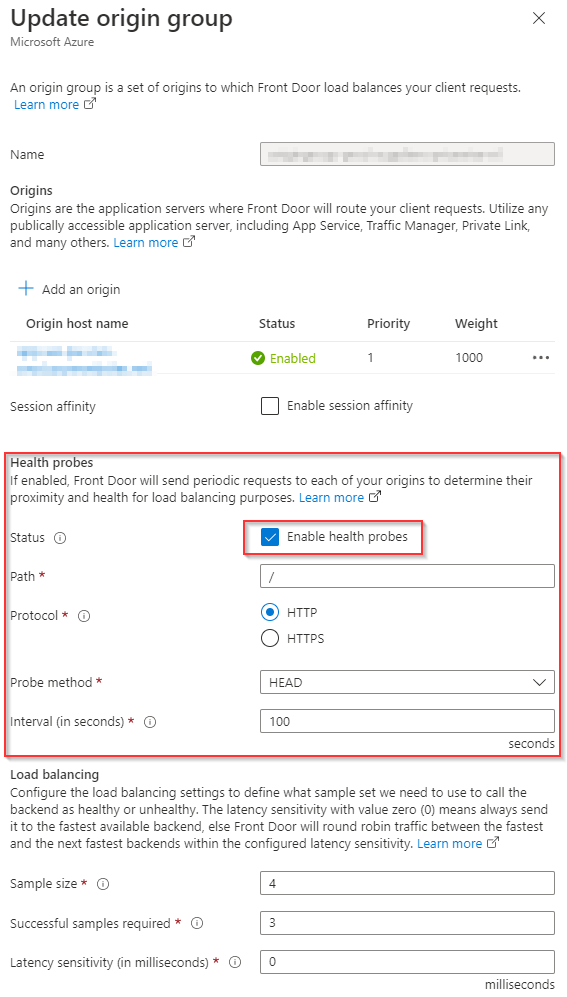
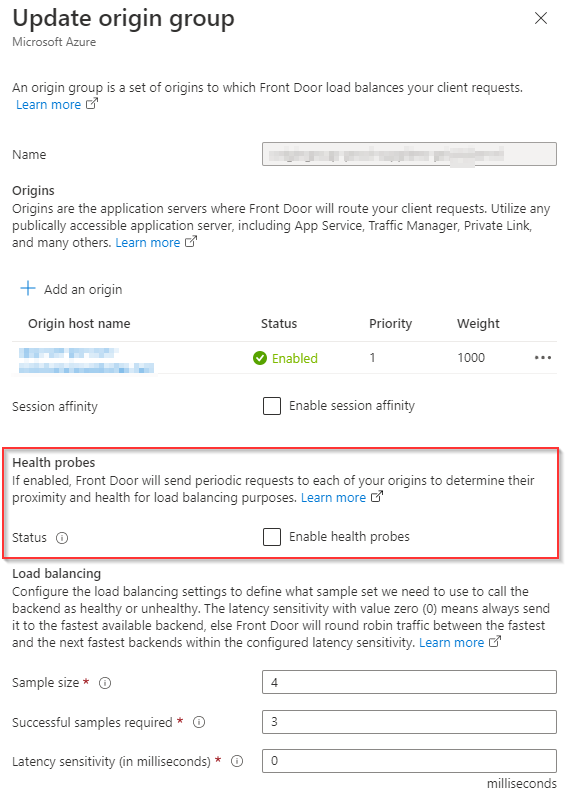

---
categories:
  - Azure
tags:
  - FrontDoor
  - CDN
  - FrontDoorStandard
  - FrontDoorPremium
  - Bicep
  - InfrastructureAsCode
date: 
  created: 2022-01-01 08:00:00
authors:
  - rbnmk
comments: true
---

# Disable Health Probe on Azure Front Door Origin Groups using Bicep

If you want to know how... read on!

<!-- more -->

## Introduction

For origins with a single backend it is recommended by the [Microsoft Learn documentation](https://learn.microsoft.com/en-us/azure/frontdoor/health-probes#disabling-health-probes) to disable the health probe to prevent the Front Door from consuming resources on your backend. Because I had troubles disabling the Health Probe using Bicep, because of lacking documentation on how to disable it, specifically for the Front Door Standard / Premium, which seems to belong to the Microsoft.Cdn resource provider. I wanted to share with you how you can disable the Health Probe, as it is quite easy, but if there is no documentation about this then it may take some time to figure it out. Click [here](#disable-the-health-probe-in-bicep) to find out how to disable it or just continue reading.

## Disable the health probe according to the (rest, arm) api documentation and reference

If you start off with an example template from the documentation you will most likely have health probe enabled, because if you have multiple backends Front Door can determine which backends are healthy, which is nice to have of course.

In the portal it is simply ticking a box as seen in the screenshot below:



According to the documentation it should be updated in the origin itself instead of the group:

* Bicep reference states it should be configured in the AFDOriginProperties, using EnabledState set to false. [See here](https://learn.microsoft.com/en-us/azure/templates/microsoft.cdn/profiles/origingroups/origins?pivots=deployment-language-bicep#afdoriginproperties)
* Front Door rest api tells me exactly the same but that obviously didn't work for me either: [See here](https://learn.microsoft.com/en-us/rest/api/frontdoor/azurefrontdoorstandardpremium/afd-origins/update#request-body)


## Disable the health probe in Bicep

In order to disable the health probe in Bicep, it turned out it is as simple as omitting the **healthProbeSettings** object in the Origin Group, so not in the Origin level! See below:

### Health probing enabled:

```bicep
resource originGroup 'Microsoft.Cdn/profiles/origingroups@2021-06-01' = {
  parent: frontDoorProfile
  name: 'originGroup'
  properties: {
    loadBalancingSettings: {
      sampleSize: 4
      successfulSamplesRequired: 3
      additionalLatencyInMilliseconds: 0
    }
    healthProbeSettings: {
      probePath: '/'
      probeRequestType: 'HEAD'
      probeProtocol: 'Https'
      probeIntervalInSeconds: 100
    }
    sessionAffinityState: 'Disabled'
  }
}
```

### Health probing disabled

```bicep
resource originGroup 'Microsoft.Cdn/profiles/origingroups@2021-06-01' = {
  parent: frontDoorProfile
  name: 'originGroup'
  properties: {
    loadBalancingSettings: {
      sampleSize: 4
      successfulSamplesRequired: 3
      additionalLatencyInMilliseconds: 0
    }
    sessionAffinityState: 'Disabled'
  }
}
```

After deployment the setting on the Origin Group should look like this:



I hope this helped you disabling the Health Probes from Bicep, because it took me some time to figure this out, and I couldn't find anything about this via my common used search engine 😉. I will try to make a comment about this on the mentioned documentation via the feedback forms.

If you have any questions or remarks about this blog please reach out to me via one of my social media channels or the comments below.