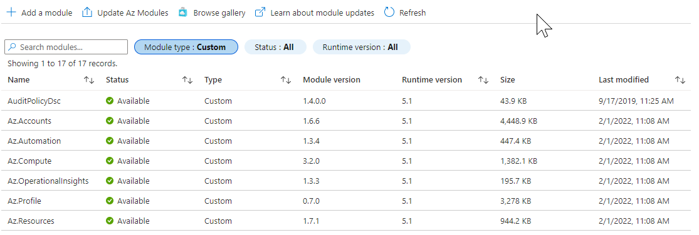

---
categories:
  - Azure
tags:
  - AzureAutomation
  - AzPowerShell
  - PowerShell
published: true
date: 
  created: 2022-11-15 08:00:00
authors:
  - rbnmk
comments: true
---

# Azure Automation Runbook: Could not convert string to DateTimeOffset

I recently started getting issues with different customers in which we use Azure Automation for Update Management. We use the pre- and post runbook functionality for quite some time already, but recently we started getting these errors..

<!-- more -->

on multiple lines in the runbook output:

``
"Could not convert string to DateTimeOffset: 1619773997. Path 'expires_on', line 1, position 2937."
``

While researching this issue I figured out it had something to do with Az Powershell and depending on a older or newer module within one of the submodules. (which can be found [here](https://github.com/microsoft/Intune-PowerShell-SDK/issues/55){:target="_blank"}) 

However I updated the Az Module to the latest available in de Azure Automation account when this came available, so why is this happening? I remembered that back in the days Azure Automation did not have AzPowershell but AzurePowerShell installed, so we installed the required modules for our scripts manually. After the Az Module was supported by the platform for newer accounts (and updating older) we started using [this](https://learn.microsoft.com/en-us/azure/automation/automation-update-azure-modules){:target="_blank"}, but we did not know that modules that were imported before that are not updating... I found out this is actually also written in the Azure Automation docs page: 

Quote from Microsoft Docs ([MSLearn](https://learn.microsoft.com/en-us/azure/automation/shared-resources/modules#default-modules){:target="_blank"}):

The recommended way for this scenario is to first delete the existing Az modules and then perform the update operations to get the latest Az module imported in the Automation account. Such module types, not imported by default, are referred to as Custom. Custom modules will always take preference over default modules
For example: If you already have the Az.Aks module imported with version 2.3.0 which is provided by Az module 6.3.0 and you try to update the Az module to the latest 6.4.0 version. The update operation will import all the Az modules from 6.4.0 package, except Az.Aks. To have the latest version of Az.Aks, first delete the existing module and then perform the update operation, or you can also update this module separately as described in Import Az modules to import a different version of a specific module.
{: .notice--warning}

Now let's fix this:

If you look at the modules in your Automation account via the portal you can filter on the module type: 'Custom', if you see any 'Az.' modules there that could be outdated. 

{: .full}

As you can see mine were not updated since february. In order to fix this you can either remove them one by one, or if you like PowerShell use this one-liner:

Please only use this script if you know what you are doing!
{: .notice--danger}

Last but not least just use the Update Az Modules button in the portal to restore all the removed modules to a working state and probably a succeeding runbook again!

Hope this helps out as I couldn't find anything about this on the world wide web.